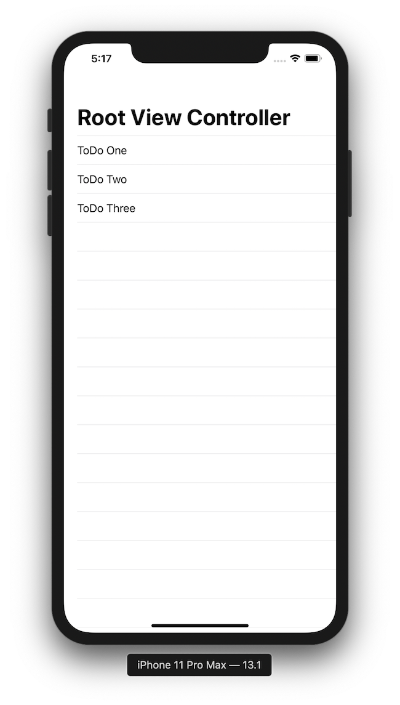
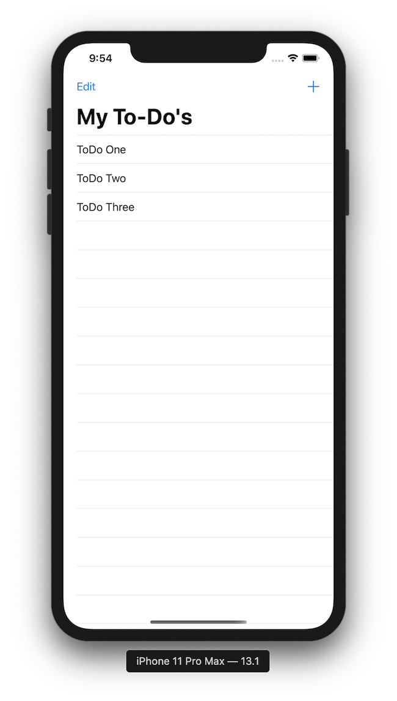
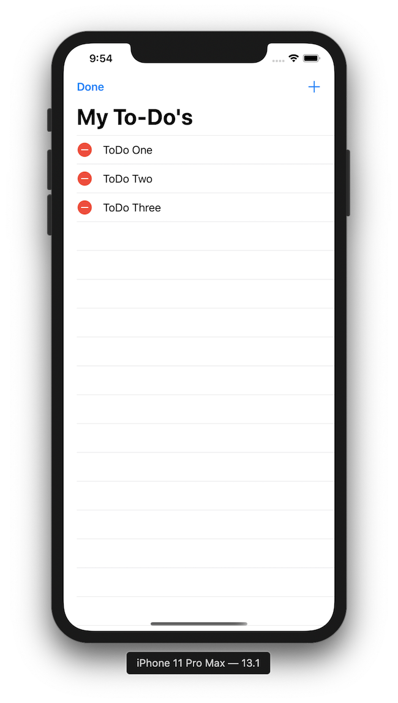

# To Do App 

1. [Week 5](https://github.com/ECC-Laboratoria/ToDo/tree/master/Week5)

2. [Week 6](https://github.com/ECC-Laboratoria/ToDo/tree/master/Week6)

   

---


## ¡Importante!

Para este nuevo proyecto estaremos trabajando de la siguiente manera para la entrega del prework:  

1. Haz un **fork** de este repositorio.
2. **Clona** el repositorio a tu escritorio o carpeta de preferencia dentro de tu computadora. 
3. Entra a la carpeta **Week5/Prework**.
4. Crea una carpeta con tu apellido paterno y nombre siguiendo la nomenclatura *UpperCamelCase* como se muestra en el siguiente ejemplo: **GaltJohn**. (Por cierto, ```Quien es John Galt?```). 
5. Responde el prework dentro de tu carpeta en un archivo llamado README.md
   1. Aunado al archivo README.md donde responderás la parte teórica, adjunta el archivo .swift o el playground con el código contestado.
6. Cuando hayas terminado de contestarlo, haz un commit y push a tu repositorio. 
7. Finalmente, haz un **pull request** donde me notifiques que haz terminado el prework. 

----

### 1. Overview del proyecto 

Para este proyecto crearemos una app que administre una lista de artículos y todas las operaciones relacionadas con la edición de artículos dentro de una lista. Si bien es un proyecto sumamente sencillo, es crucial entenderlo muy bien, pues los ```UITableViewControllers``` son el elemento más popular de UIKit. Algunas de las operaciones que se pueden realizar sobre un ```UITableViewController``` son las siguientes: 

1. Desplegar la lista.
2. Agregar elementos a la lista.
3. Editar los elementos de la lista.
4. Borrar elementos de la lista.
5. Guardar los elementos de la lista en el dispositivo.

Aunado a lo anterior, en este proyecto trabajaremos con una lista de pendientes (to do). Cada pendiente tendrá una fecha límite y unas notas. Cada pendiente podrá ser marcado como completado, pero se mantendrá en la lista hasta que el usuario lo elimine. Por esta razón, este proyecto deberá seguir las siguientes guías de diseño:

1. Cuando la app se abra, ésta desplegará la lista de los pendientes. 
2. Dentro de la vista principal, controles para agregar y borrar pendientes de la lista. 
3. Al dar tap en un pendiente, la app mostrará información más detallada sobre cada pendiente. 
4. En la vista de detalle, el usuario podrá editar el pendiente seleccionado. 
5. La app guarda la última versión de la lista. 

### 2. Objetivos del proyecto

1. **UIKit**: entender ```UITableViewController```, ```UITableViewCell``` 
2. **Swift**: entender las diferencias entre una clase y una estructura, entender los protocolos y ejemplos de algunos de ellos. 
3. **Computer Science**: arquitectura Modelo Vista Controlador, ciclo de vida de una app. 
4. **Soft skills**: fomentar la creatividad y el trabajo en equipo mediante squads. 

### 3. Consideraciones generales y entregables

Este tercer proyecto se realizará en tripletas, te recomendamos que eligan una computadora sobre la cual estarán programando y que ocupen las otras dos computadoras para investigar y leer material complementario. 

Para este tercer proyecto, es necesario que una integrante de la tripleta cree un **fork** del repositorio y cree una carpeta con el nombre de su tripleta. Cada tripleta tendrá un nombre asignado por un algoritmo. Si quieren trabajar de manera remota puden forkear de nuevo el repositorio forkeado por la integrante de su tripleta o que la integrante que lo forkeo las haga colaboradoras. 

Para la entrega del proyecto, deberán crear un **pull request** para que se considerado como válido  y poner un mensaje relevante con la entrega. Aunado a lo anterior, para que el proyecto sea considerado como válido, todas las integrantes deberán codificar o crear una parte de la interfaz del proyecto. 

El algoritmo anterior, aunado a darles con quienes estarán trabajando y el nombre de su tripleta, también les asignará una parte del proyecto. Es decir, cada integrante de la tripleta será responsable de una parte del proyecto. Por ejemplo: 

```
Danny Taggard: UI.
John Galt: UITableViewController.
Howard Roark: UITableViewCell y operaciones sobre la lista.
```

Al terminar la sesión, deberán hacer otro **pull request** donde reflejarán el trabajo que hicieron durante la sesión. Para que el **pull request** sea válido, deberán subirlo antes de las 14:05 pm. Si quieren seguir trabajando después, adelante, pero solo se contará como válido el pull request que envién antes de terminar la clase. 

### 4. Checklist 

#### Setup

1. Haz un fork del este repositorio. 
2. Clona el repositorio que forkeaste dentro del escritorio. 
3. Crea una carpeta con el nombre de tu tripleta. 
4. Agrega un archivo README.md con el nombre de las integrantes de tu tripleta y su responsabilidad dentro del proyecto. 
5. Creen un proyecto de Xcode llamado **ToDoApp** con la plantilla ```Single View Application```y guárdenlo dentro de la carpeta que crearon. 
   1. **Asegúrense** de que seleccionen para la opción de ```User Interface``` la opción de ```Storyboard```. 
   2. **Asegúrense** de que la casilla ```Create Git repository on my Mac``` esté **deseleccionada**

---

#### Primera sección: RootViewController

#### UI

1. Agrega un ```UITableViewController``` embebido en un ```UINavigationController``` y modifica lo que sea necesario para que tu primer vista se vea así: 

   

2. Asígnale un identificador a la celda del ```UITableViewController```. 

3. 

#### Modelo 

1. Crea un modelo para un objeto llamado ```ToDo``` y define las siguientes propiedades: 
   * Título, indicador sobre si ya se completó el ToDo, fecha, notas.
   * Ojo, no todos los ToDo tendrán notas. ¿Qué significa esto para la definición de mi modelo?
2. Dentro del modelo  ```ToDo```, escribe un método estático (```static```) que obtenga la información guardada en disco y regrese un arreglo de ```ToDo```'s si es que los logró encontrar. (considera usar opcionales para el arreglo que tiene que regresar esta función. El código de esta función la escribirás más adelante, por lo que regresa ```nil``` por el momento. 
3. Dentro del modelo ```ToDo```, escribe otro método estático encargado de generar un arreglo de ```ToDo``` con información de prueba (mock-up data). 
   * Como mockup data, para el atributo de fecha, asigna lo siguiente: (para los demás parámetros asígnale los datos que quieras)
   * ```ToDo(title: "Un título", isComplete: false, dueDate: Date(), notes: "...")```
4. 

#### Controlador 

1. Una vez que tengas diseñana la interfaz del punto uno de la sección de **UI**, necesitarás crear una clase para controlar la interfaz. Llámala ```ToDoTableViewController``` y  esta clase debe heredar de la clase  ```UITableViewController```. Puedes crearla desde cero o como una **CocoaTouchClass**. Recuerda, ```UITableViewController``` pertenece a ```UIKit```. 
   * No olvides de ligar la interfaz con la clase que acabas de crear. 
2. Inicializa un arreglo vacío de ```ToDo``` (completa el punto uno de la sección **Modelo**) o continua con el siguiente punto si tu compañera de equipo aún no termina la sección de **Modelo**. 
3. Sobre carga los métodos ```numberOfRowsInSection``` y ```cellForRowAt``` y defínelos correctamente para que se despliegue la información del arreglo de ```todos```. 
4. Sobrecarga el método ```viewDidLoad()```. 
   * Recuerda llamar a ```super.ViewDidLoad()```. 
5. Dentro de ```viewDidLoad()``` asigna al arreglo vacío de ```ToDo```'s  la información de los métodos estáticos del punto 2 y 3 de la sección de **Modelo**. En caso de que el método del punto 2 de esa misma sección regrese ```nil```, asíganle el mock up data al arreglo del método del punto 3. 

#### Punto de control primera sección: 



---

#### Segunda sección: controles

#### UI

1. Arrastra un ```UIBarButtonIttem``` al navigation bar y cambia el ```System Item``` a ```Add```.
2. Cambia el título del navigation bar a: ```My To-Do`s``` 
3. Arrastra un ```UINavigationController``` a la escena. 
4. Arrastra del botón ```Add``` al ```UINavigationController``` y selecciona **Present Modally**. 


#### Modelo

#### Controlador

1. Agrega el código necesario para borrar elementos del ```UITableView```. 
2. Agrega un ```editButtonItem``` a la propiedad ```leftBarButtonItem``` del navigation bar. 

#### Punto de control segunda sección 





---

### 5. Hacker edition 

!Felicidades! Lograron completar el tercer proyecto. ¿Quieren avanzar un poco más?:

* Implementen una funcionalidad de búsqueda de ToDo's.
* Implementen una funcionalidad de filtrado por ToDo's completados. 

### 6. Referencias y lecturas complementarias 

- **Introducción al Desarrollo de Apps**. [https://books.apple.com/mx/book/introducci%C3%B3n-al-desarrollo-de-apps-con-swift/id1216831475](https://books.apple.com/mx/book/introducción-al-desarrollo-de-apps-con-swift/id1216831475)
- **App Development with Swift.** https://books.apple.com/us/book/app-development-with-swift/id1219117996
- **The Swift Programming Language Guide.** https://docs.swift.org/swift-book/LanguageGuide/TheBasics.html
- **Apple’s World Wide Developers Conference Videos.** https://developer.apple.com/videos/
- **Human Interface Guidelines: iOS.** https://developer.apple.com/design/human-interface-guidelines/ios/overview/themes/
- **Apple Developer**. https://developer.apple.com/

Otros sitios recomendados:

- **Paul Hudson. Swift in Sixty Seconds.** https://www.hackingwithswift.com/sixty

